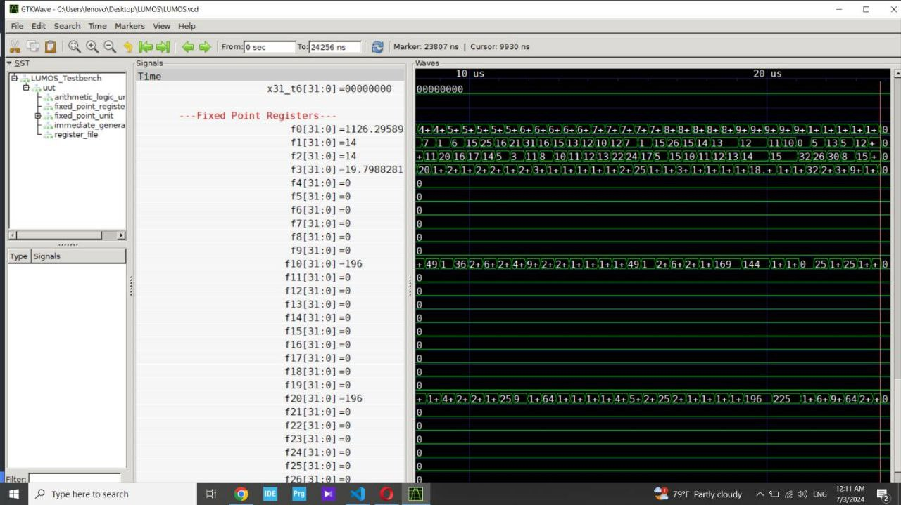

Computer Organization - Spring 2024
==============================================================
## Iran Univeristy of Science and Technology
## Assignment 2: Light Utilization with Multicycle Operational Stages (LUMOS) RISC-V Processor Core

- Name:Amirreza Rahbar/400412238
- Team Members:Amirhosein Wierman yazdi/400413467
- Date:13/04/03

## Report
Fixed Point Unit Project
Introduction
This project implements a Fixed Point Unit (FPU) that performs various arithmetic operations including multiplication, addition, subtraction, and square root calculation. The FPU is designed to handle fixed-point numbers and is parameterized to support different bit-widths and fractional bit counts.

Modules Overview
1. Fixed_Point_Unit
The main module of the project, Fixed_Point_Unit, is responsible for orchestrating the arithmetic operations based on the input parameters and control signals.

Parameters:
WIDTH: Bit-width of the operands.
FBITS: Number of fractional bits in the operands.
Inputs:
clk: Clock signal.
reset: Reset signal.
operand_1: First operand for the arithmetic operation.
operand_2: Second operand for the arithmetic operation.
operation: Control signal specifying the operation to be performed.
Outputs:
result: Result of the arithmetic operation.
ready: Signal indicating the completion of the operation.
Internal States:
IDLE, MUL_P1, MUL_P2, MUL_P3, MUL_P4, FINISH: States for the multiplication operation.
Functionality:
The module uses a state machine to control the flow of operations.
Depending on the operation input, it can perform multiplication, addition, subtraction, or square root calculation.
For multiplication, the module breaks down the operation into smaller partial products and combines them to get the final result.
For square root calculation, a state machine is used to iteratively compute the result using a series of additions and subtractions.
2. Multiplier
A helper module that performs multiplication of two 16-bit operands.

Inputs:
operand_1: First 16-bit operand.
operand_2: Second 16-bit operand.
Outputs:
product: 32-bit product of the two operands.
Functionality:
This module uses a simple combinational logic to multiply two 16-bit numbers.
Detailed Description of Code Sections
State Machine for Multiplication
The state machine for multiplication is divided into several states (IDLE, MUL_P1, MUL_P2, MUL_P3, MUL_P4, FINISH). Each state performs a specific part of the multiplication process, such as:

MUL_P1: Multiplies the lower 16 bits of both operands.
MUL_P2: Multiplies the lower 16 bits of operand 1 with the upper 16 bits of operand 2.
MUL_P3: Multiplies the upper 16 bits of operand 1 with the lower 16 bits of operand 2.
MUL_P4: Multiplies the upper 16 bits of both operands.
The results of these partial products are then shifted and added together to form the final 64-bit product, which is then adjusted according to the fractional bit count (FBITS) to produce the final result.

Square Root Calculation
The square root calculation is handled by another state machine with states (INIT, BEGIN, COMPUTE, FINISH). The algorithm used is a bit-serial approach:

In the INIT state, the module initializes variables and prepares for the computation.
The BEGIN state starts the computation.
The COMPUTE state iteratively computes the square root by testing partial results and adjusting the accumulator and operand accordingly.
In the FINISH state, the final result is produced and the module returns to the INIT state.
Handling Other Operations
The module can also perform addition and subtraction directly using combinational logic, based on the operation control signal.

Reset and Initialization
When the reset signal is high, the module initializes all internal registers and prepares for a new operation.

How to Use
Instantiate the Module: Instantiate the Fixed_Point_Unit module in your design with appropriate parameters for WIDTH and FBITS.
Provide Inputs: Connect the clk, reset, operand_1, operand_2, and operation signals.
Read Outputs: Monitor the result and ready signals to get the output of the operation and to know when the operation is complete.
Example Instantiation

Fixed_Point_Unit #(
    .WIDTH(32),
    .FBITS(10)
) fpu_inst (
    .clk(clk),
    .reset(reset),
    .operand_1(operand_1),
    .operand_2(operand_2),
    .operation(operation),
    .result(result),
    .ready(ready)
);
Conclusion
This project demonstrates a versatile Fixed Point Unit capable of performing several arithmetic operations with a focus on fixed-point arithmetic. The modular design allows for easy extension and customization to fit various bit-width and fractional bit requirements.

